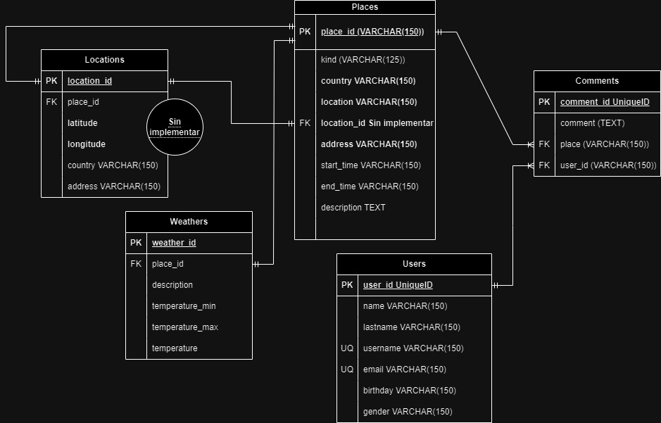

# Places API

## Diseño del Sistema

## Endpoints Habilitados

## /api/v1/users
* Obtener todos los usuarios: GET /api/v1/users

* Actualizar usuario: PUT /api/v1/users/{id}

* Eliminar usuario: DELETE /api/v1/users/{id}

* Crear usuario: POST /api/v1/users

    * Campos obligatorios:
`{
    "name": "",
    "lastname": "",
    "email": "",
    "username": "",
    "gender": ""
}`

## /api/v1/places
* Obtener todos los lugares: GET /api/v1/places (Query Params: sort & kind & country)

* Obtener un lugar por ID: GET /api/v1/places/{placeId}

* Obtener lugares por nombre: GET /api/v1/places/placeName/{placeName}

* Eliminar un lugar: DELETE /api/v1/places/{placeId}

* Actualizar un lugar: PUT /api/v1/places/{placeId}

* Crear un lugar: POST /api/v1/places

    * Campos obligatorios:
`{
    "kind": "",
    "name": "",
    "country": "",
    "location": "",
    "address": "",
    "start_time": "",
    "end_time": "",
    "description": ""
}`

## Comments
Crear un comentario en el lugar: POST /api/v1/place/{placeId}/user/{userId}

## Search
Buscar lugar: GET /api/v1/places/placeName/{name}

TODO: Mejorar deficion del las rutas: Comments y Search

