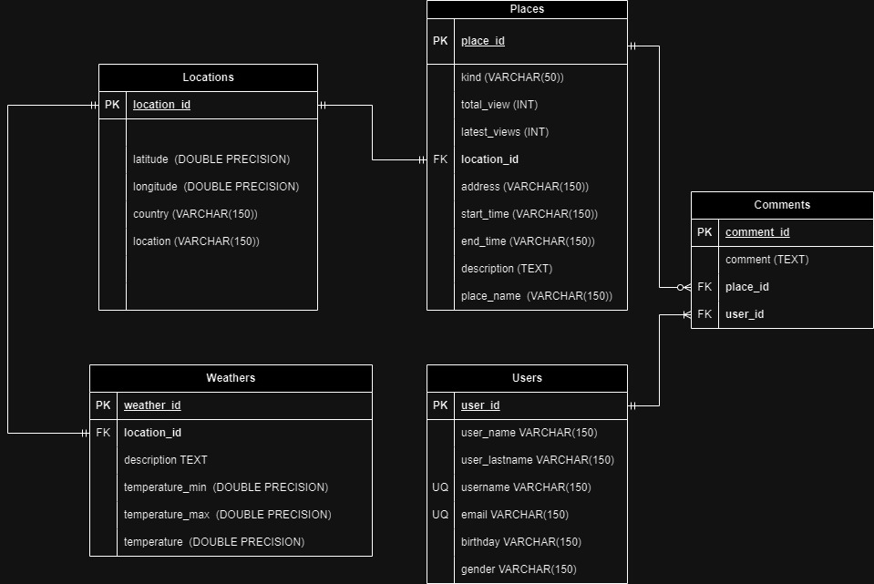

# Places API

## Diseño del Sistema

### PLACE V1 (DEPRECADO)

### PLACE V2 (ACTUAL)

## Endpoints Habilitados

## User
* Obtener todos los usuarios:  GET /api/v1/users

* Actualizar usuario:          PUT /api/v1/users/{id}

* Eliminar usuario:            DELETE /api/v1/users/{id}

* Crear usuario:               POST /api/v1/users

    * Campos obligatorios:
`{
    "user_name": "",
    "user_lastname": "",
    "email": "",
    "username": "",
    "gender": ""
}`

## Place
* Obtener todos los lugares:      GET /api/v1/places (Query Params: sort & kind & country)

* Obtener un lugar por ID:        GET /api/v1/places/{placeId}

* Obtener lugares por nombre:     GET /api/v1/places/placeName/{placeName}

* Eliminar un lugar:              DELETE /api/v1/places/{placeId}

* Actualizar un lugar:            PUT /api/v1/places/{placeId}

* Crear un lugar:                 POST /api/v1/places

    * Campos obligatorios:
`{
    "kind": "",
    "place_name": "",
    "country": "",
    "address": "",
    "start_time": "",
    "end_time": "",
    "description": ""
}`

## Comment
* Crear un comentario en el lugar:                POST /api/v1/place/{placeId}/user/{userId}

* Obtener todos por usuario:                      GET /api/v1/place/{placeId}/user/{userId}

* Obtener los comentarios del usuario por lugar:  GET /api/v1/place/{placeId}/user/{userId}

## Weather

* Obtener clima por nombre del lugar:             GET /api/v1/weather/place/{placeName}
  
* Obtener clima por locationId:                   GET /api/v1/weather/location/{locationId}

TABLA LOCATION NEEDS REWORKS: DEBE SER INDEPENDIENTE :)

